# クラス関係ドキュメント

## 概要

このドキュメントは、デザインシステムドキュメント生成ツールにおける全クラス間の詳細な関係性、依存関係、相互作用について説明します。各クラスがどのように連携し、データがどのように流れ、どのような責務分担がされているかを包括的に解説します。

## クラス関係図

### レイヤー別クラス構成

```mermaid
graph TB
    subgraph "CLI Layer"
        CLI[cli.ts]
    end
    
    subgraph "Command Layer"
        GenCmd[GenerateCommand]
        SnapCmd[SnapshotCommand]
        DiffCmd[DiffCommand]
        ConvCmd[ConvertCommand]
        ValidCmd[ValidateCommand]
        WatchCmd[WatchCommand]
    end
    
    subgraph "Configuration Layer"
        ConfigMgr[ConfigManager<br/>Singleton]
    end
    
    subgraph "Extraction Layer"
        TailwindExt[TailwindExtractor<br/>Main Orchestrator]
        DesignTokenExt[DesignTokenExtractor]
        StyleExtFactory[StyleExtractorFactory]
        TailwindStyleExt[TailwindStyleExtractor]
        StyleSheetExt[StyleSheetExtractor]
        StyledCompExt[StyledComponentsExtractor]
        CSSModExt[CSSModulesExtractor]
    end
    
    subgraph "AST Layer"
        ASTTrav[ASTTraverser]
        CompAnalyzer[ComponentAnalyzer]
        PropExt[PropExtractor]
        JSXStructExt[JSXStructureExtractor]
        TailwindClassExt[TailwindClassExtractor]
        CompCategorizer[ComponentCategorizer]
    end
    
    subgraph "Generation Layer"
        AIDocGen[AIDocumentGenerator<br/>Main Orchestrator]
        CompDocGen[ComponentDocumentGenerator]
        PatternDetector[PatternDetector]
        GuidelineGen[GuidelineGenerator]
        MarkdownFmt[MarkdownFormatter]
        MultiPlatformGen[MultiPlatformDocumentGenerator]
    end
    
    subgraph "Diff Layer"
        DiffEngine[DiffEngine]
    end
    
    subgraph "Utility Layer"
        FileUtils[FileUtils]
        Hash[Hash]
        CodeValidation[CodeValidator]
        StyleConverter[StyleConverter]
        ASTUtils[ASTUtils]
        ComponentUtils[ComponentUtils]
        StringUtils[StringUtils]
        TailwindUtils[TailwindUtils]
    end
    
    %% Layer connections
    CLI --> GenCmd
    CLI --> SnapCmd
    CLI --> DiffCmd
    CLI --> ConvCmd
    CLI --> ValidCmd
    CLI --> WatchCmd
    
    GenCmd --> ConfigMgr
    GenCmd --> TailwindExt
    GenCmd --> AIDocGen
    
    SnapCmd --> TailwindExt
    SnapCmd --> FileUtils
    
    DiffCmd --> DiffEngine
    DiffCmd --> FileUtils
    
    TailwindExt --> DesignTokenExt
    TailwindExt --> StyleExtFactory
    TailwindExt --> ASTTrav
    TailwindExt --> CompCategorizer
    
    StyleExtFactory --> TailwindStyleExt
    StyleExtFactory --> StyleSheetExt
    StyleExtFactory --> StyledCompExt
    StyleExtFactory --> CSSModExt
    
    ASTTrav --> CompAnalyzer
    ASTTrav --> PropExt
    ASTTrav --> JSXStructExt
    ASTTrav --> TailwindClassExt
    
    AIDocGen --> CompDocGen
    AIDocGen --> PatternDetector
    AIDocGen --> GuidelineGen
    AIDocGen --> MarkdownFmt
    
    CompDocGen --> CodeValidation
    
    %% Utility dependencies
    TailwindExt --> FileUtils
    DesignTokenExt --> Hash
    CompAnalyzer --> ASTUtils
    TailwindClassExt --> TailwindUtils
    StyleConverter --> ComponentUtils
    MarkdownFmt --> StringUtils
```



## 詳細クラス関係分析

### 1. 設定管理の中核：ConfigManager

#### 関係するクラス
- **依存される側**: ほぼ全てのクラス
- **直接的な依存関係**: なし（Singleton）

#### 関係性の詳細
```typescript
// ConfigManagerの使用パターン
class TailwindExtractor {
  constructor() {
    this.config = ConfigManager.getInstance(); // Singleton アクセス
  }
  
  extract() {
    const platform = this.config.getPlatform(); // 設定取得
    const styleSystem = this.config.getStyleSystem();
    // プラットフォーム固有の処理
  }
}
```

#### 影響範囲
- **全てのエクストラクター**: プラットフォーム/スタイルシステム設定
- **全てのジェネレーター**: 出力形式、言語設定
- **全てのコマンド**: 実行時パラメータ

### 2. 抽出処理の司令塔：TailwindExtractor

#### 直接依存するクラス
```typescript
class TailwindExtractor {
  private designTokenExtractor: DesignTokenExtractor;      // デザイントークン抽出
  private styleExtractorFactory: StyleExtractorFactory;   // スタイル抽出器生成
  private astTraverser: ASTTraverser;                     // AST走査
  private componentCategorizer: ComponentCategorizer;      // コンポーネント分類
  private fileUtils: FileUtils;                          // ファイル操作
}
```

#### 協調関係
1. **初期化フェーズ**
   ```typescript
   // 設定ベースの初期化
   const platform = ConfigManager.getInstance().getPlatform();
   const styleExtractor = StyleExtractorFactory.createExtractor(platform, config);
   ```

2. **抽出フェーズ**
   ```typescript
   // AST解析と要素抽出の協調
   await astTraverser.traverse(filePath, {
     onComponent: (node) => componentAnalyzer.analyze(node),
     onClassName: (node) => tailwindClassExtractor.extractClasses(node),
     onProps: (node) => propExtractor.extract(node)
   });
   ```

3. **統合フェーズ**
   ```typescript
   // 各エクストラクターの結果統合
   const tokens = await designTokenExtractor.extractFromTailwindConfig(configPath);
   const styles = styleExtractor.extractStyles(astNode);
   const category = componentCategorizer.categorize(component);
   ```

### 3. AST解析の協調関係

#### ASTTraverserを中心とした関係
```typescript
interface ASTCallbacks {
  onComponent?: (node: Node) => void;        // ComponentAnalyzer
  onClassName?: (node: Node) => void;        // TailwindClassExtractor  
  onProps?: (node: Node) => void;            // PropExtractor
  onJSXElement?: (node: Node) => void;       // JSXStructureExtractor
}

class ASTTraverser {
  async traverse(filePath: string, callbacks: ASTCallbacks) {
    // 各専門アナライザーへのディスパッチ
    ast.forEachChild(node => {
      if (isComponentDeclaration(node)) callbacks.onComponent?.(node);
      if (isClassNameAttribute(node)) callbacks.onClassName?.(node);
      if (isPropsInterface(node)) callbacks.onProps?.(node);
      if (isJSXElement(node)) callbacks.onJSXElement?.(node);
    });
  }
}
```

#### 専門アナライザー間の協調
```typescript
// ComponentAnalyzer → PropExtractor の連携
class ComponentAnalyzer {
  analyze(node: Node): ComponentInfo {
    const componentName = this.extractName(node);
    const propsInfo = this.propExtractor.extractFromComponent(node); // 委譲
    return { componentName, propsInfo };
  }
}

// TailwindClassExtractor → TailwindUtils の連携
class TailwindClassExtractor {
  extractClasses(node: Node): string[] {
    const classes = this.parseClassNode(node);
    return classes.filter(cls => TailwindUtils.isTailwindClass(cls)); // ユーティリティ活用
  }
}
```

### 4. ドキュメント生成の協調関係

#### AIDocumentGeneratorを中心とした関係
```typescript
class AIDocumentGenerator {
  private componentDocGenerator: ComponentDocumentGenerator;
  private patternDetector: PatternDetector;
  private guidelineGenerator: GuidelineGenerator;
  private markdownFormatter: MarkdownFormatter;
  
  async generate(components: ExtractedComponent[], tokens: DesignTokens): Promise<GenerationResult> {
    // フェーズ1: 個別コンポーネントドキュメント生成
    const componentDocs = components.map(comp => 
      this.componentDocGenerator.generateComponentDoc(comp, components, options)
    );
    
    // フェーズ2: パターン検出
    const patterns = this.patternDetector.detectPatterns(components);
    
    // フェーズ3: ガイドライン生成
    const guidelines = this.guidelineGenerator.generateGuidelines(components, tokens);
    
    // フェーズ4: 最終ドキュメント統合
    const document = { componentDocs, patterns, guidelines, tokens };
    
    return { document, metadata };
  }
}
```

#### ComponentDocumentGeneratorの詳細関係
```typescript
class ComponentDocumentGenerator {
  private codeValidator: CodeValidator; // コード検証
  
  generateComponentDoc(component: ExtractedComponent): ComponentDoc {
    // 説明文生成（内部ロジック）
    const description = this.generateDescription(component);
    
    // Props詳細化（PropExtractorの結果を活用）
    const props = component.props.map(prop => this.convertPropToDoc(prop));
    
    // コード例生成と検証（CodeValidatorとの連携）
    const examples = this.generateAndValidateExamples(component);
    
    return { description, props, examples };
  }
}
```

### 5. スタイル抽出の階層関係

#### Factory Pattern による生成関係
```typescript
class StyleExtractorFactory {
  static createExtractor(styleSystem: StyleSystem, config: ExtractorConfig): StyleExtractor {
    switch (styleSystem) {
      case 'tailwind':
        return new TailwindStyleExtractor(config);
      case 'stylesheet':
        return new StyleSheetExtractor(config);
      case 'styled-components':
        return new StyledComponentsExtractor(config);
      case 'css-modules':
        return new CSSModulesExtractor(config);
    }
  }
}
```

#### 抽象基底クラスと具象実装の関係
```typescript
abstract class StyleExtractor {
  protected config: ExtractorConfig;
  
  abstract extractStyles(node: any): ExtractedStyleInfo[];
  abstract validateStyles(styles: string[]): ValidationResult;
  abstract generateExamples(styles: ExtractedStyleInfo[]): string;
}

class TailwindStyleExtractor extends StyleExtractor {
  extractStyles(node: any): ExtractedStyleInfo[] {
    // Tailwind固有の抽出ロジック
    return this.extractTailwindClasses(node);
  }
}

class StyleSheetExtractor extends StyleExtractor {
  extractStyles(node: any): ExtractedStyleInfo[] {
    // React Native StyleSheet固有の抽出ロジック
    return this.extractStyleSheetReferences(node);
  }
}
```

### 6. データ変換と検証の関係

#### StyleConverter の役割
```typescript
class StyleConverter {
  // TailwindクラスをReact Native StyleSheetに変換
  tailwindToStyleSheet(classes: string[]): StyleSheetStyles {
    return classes.reduce((styles, className) => {
      const convertedStyle = TailwindUtils.convertToRN(className);
      return { ...styles, ...convertedStyle };
    }, {});
  }
  
  // React Native StyleSheetをTailwindクラスに変換
  styleSheetToTailwind(styles: StyleSheetStyles): string[] {
    return Object.entries(styles).map(([prop, value]) => 
      TailwindUtils.findEquivalentClass(prop, value)
    ).filter(Boolean);
  }
}
```

#### CodeValidator の検証関係
```typescript
class CodeValidator {
  validateExampleCode(code: string, componentName: string): ValidationResult {
    // TypeScript構文検証
    const syntaxResult = this.validateSyntax(code);
    
    // コンポーネント存在確認
    const componentResult = this.validateComponentUsage(code, componentName);
    
    // Tailwindクラス検証
    const tailwindResult = this.validateTailwindClasses(code);
    
    return this.mergeResults([syntaxResult, componentResult, tailwindResult]);
  }
}
```

### 7. 差分検出の専門関係

#### DiffEngine の独立性と連携
```typescript
class DiffEngine {
  // 他クラスへの依存は最小限
  private differ: jsondiffpatch.DiffPatcher;
  
  async compareSnapshots(oldSnapshot: Snapshot, newSnapshot: Snapshot): Promise<DiffResult> {
    // 独立した比較ロジック
    const componentDiff = this.compareComponents(oldSnapshot.components, newSnapshot.components);
    const tokenDiff = this.compareTokens(oldSnapshot.tokens, newSnapshot.tokens);
    
    return { componentDiff, tokenDiff };
  }
}

// DiffEngineを使用するコマンド
class DiffCommand {
  async execute() {
    const diffEngine = new DiffEngine();
    const result = await diffEngine.compareSnapshots(oldSnapshot, newSnapshot);
    diffEngine.displayDiff(result); // 結果表示も DiffEngine が担当
  }
}
```

## データフローにおけるクラス連携

### 1. コンポーネント抽出フロー

```typescript
// フロー1: ファイル → AST → コンポーネント情報
FileUtils.readFiles(srcPath)
  → ASTTraverser.traverse(filePath)
    → ComponentAnalyzer.analyze(node) // React コンポーネント検出
    → PropExtractor.extract(node)     // Props 情報抽出
    → JSXStructureExtractor.extract(node) // JSX 構造抽出
    → TailwindClassExtractor.extractClasses(node) // クラス抽出
  → ComponentCategorizer.categorize(component) // Atomic Design 分類
```

### 2. スタイル抽出フロー

```typescript
// フロー2: 設定 → スタイル抽出器 → スタイル情報
ConfigManager.getInstance().getStyleSystem()
  → StyleExtractorFactory.createExtractor(styleSystem)
    → TailwindStyleExtractor.extractStyles(node) // Tailwind の場合
    → TailwindClassExtractor.extractClasses(node) // クラス詳細抽出
  → StyleConverter.convert(styles) // 必要に応じて形式変換
```

### 3. トークン抽出フロー

```typescript
// フロー3: 設定ファイル → デザイントークン
DesignTokenExtractor.extractFromTailwindConfig(configPath)
  → this.extractColors(theme.colors) // カラートークン
  → this.extractSpacing(theme.spacing) // スペーシング
  → this.extractTypography(theme) // タイポグラフィ
  → Hash.generateTokenId(token) // ユニークID生成
```

### 4. ドキュメント生成フロー

```typescript
// フロー4: 構造化データ → ドキュメント
AIDocumentGenerator.generate(components, tokens)
  → ComponentDocumentGenerator.generateComponentDoc(component)
    → CodeValidator.validateExampleCode(example) // コード例検証
  → PatternDetector.detectPatterns(components) // パターン検出
  → GuidelineGenerator.generateGuidelines(components, tokens) // ガイドライン
  → MarkdownFormatter.generateMarkdown(document) // Markdown 変換
```

## 依存関係の方向性

### 1. 上位レイヤーから下位レイヤーへの依存
```
Command Layer → Configuration Layer
Command Layer → Extraction Layer
Command Layer → Generation Layer
Extraction Layer → AST Layer
Generation Layer → Utility Layer
```

### 2. 水平関係（同一レイヤー内）
```
TailwindExtractor ←→ DesignTokenExtractor (相互参照)
ComponentAnalyzer → PropExtractor (委譲関係)
AIDocumentGenerator → ComponentDocumentGenerator (オーケストレーション)
```

### 3. 逆方向依存の回避
- **Interface/Abstract Class**: 抽象に依存し、具象に依存しない
- **Dependency Injection**: ConfigManager の Singleton 注入
- **Event-driven**: コールバックによる疎結合

## 設計パターンによるクラス関係

### 1. Singleton Pattern
```typescript
ConfigManager ←─── (使用) ←─── 全てのクラス
```

### 2. Factory Pattern
```typescript
StyleExtractorFactory
├── TailwindStyleExtractor
├── StyleSheetExtractor
├── StyledComponentsExtractor
└── CSSModulesExtractor
```

### 3. Strategy Pattern
```typescript
StyleExtractor (抽象)
├── TailwindStyleExtractor (Tailwind戦略)
├── StyleSheetExtractor (RN戦略)
└── カスタム戦略 (拡張可能)
```

### 4. Orchestrator Pattern
```typescript
TailwindExtractor (抽出のオーケストレーター)
├── DesignTokenExtractor
├── StyleExtractorFactory
├── ASTTraverser
└── ComponentCategorizer

AIDocumentGenerator (生成のオーケストレーター)
├── ComponentDocumentGenerator
├── PatternDetector
├── GuidelineGenerator
└── MarkdownFormatter
```

### 5. Template Method Pattern
```typescript
StyleExtractor (テンプレート)
├── extractStyles() (抽象メソッド)
├── validateStyles() (抽象メソッド)
└── generateExamples() (抽象メソッド)

具象クラスが各メソッドを実装
```

## エラーハンドリングにおけるクラス連携

### 1. エラー伝播の制御
```typescript
try {
  TailwindExtractor.extract()
    → ComponentAnalyzer.analyze() // エラー時は警告ログ、処理継続
    → PropExtractor.extract()     // エラー時はデフォルト値、処理継続
} catch (error) {
  // システム全体は停止せず、部分的成功で継続
}
```

### 2. フォールバック関係
```typescript
DesignTokenExtractor
├── extractFromTailwindConfig() // 第1選択
├── extractFromStyleSheet()     // 第2選択  
└── getDefaultTokens()          // フォールバック
```

## パフォーマンス最適化のためのクラス連携

### 1. キャッシュ戦略
```typescript
ASTTraverser
├── AST解析結果キャッシュ
└── ファイル変更検出

ConfigManager
├── 設定ファイルキャッシュ
└── 解析済み設定キャッシュ
```

### 2. 並列処理の協調
```typescript
TailwindExtractor {
  async extractParallel(files: string[]) {
    const promises = files.map(file => 
      this.astTraverser.traverse(file, callbacks)
    );
    return Promise.all(promises); // 並列AST解析
  }
}
```

## 拡張性を支えるクラス関係

### 1. プラグインアーキテクチャ
```typescript
ConfigManager.registerCustomStyleSystem('my-system', {
  extractor: './path/to/MyExtractor'
});

StyleExtractorFactory.createExtractor('my-system', config)
  → new MyCustomExtractor(config) // 動的読み込み
```

### 2. カスタマイゼーション ポイント
- **StyleExtractor**: 新しいスタイルシステム対応
- **DocumentGenerator**: カスタムドキュメント形式
- **Formatter**: 新しい出力形式
- **Validator**: カスタム検証ルール

この詳細なクラス関係ドキュメントにより、システムの内部構造と各クラスの相互作用を深く理解し、効果的な拡張や保守が可能になります。